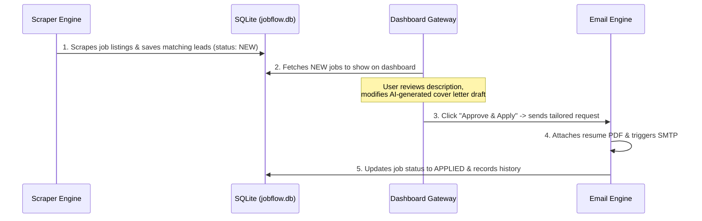

# Jobflow 🚀
### Automated Local Job Application & Email Assistant

Jobflow is a self-hosted, modular system designed to automate the painful parts of job hunting: discovering postings, scoring compatibility, tailoring cover letters, tracking application status, and emailing recruiters.

It runs locally on your machine via **Docker / Podman** and stores all data in a local **SQLite** database, keeping your resume and credentials private.

---

## 🏗️ Architecture & Flow

Jobflow is designed around a **Human-in-the-Loop** model. Instead of fully automated bots applying blindly (which get blocked by firewalls or output incorrect information), Jobflow aggregates matching roles, scores them, drafts custom pitches, and presents them to you in a dashboard for approval before sending.



---

## 📂 Project File Tree

```text
jobflow/
├── .env                  # API keys, SMTP credentials (git-ignored)
├── .gitignore            # Ignores .env, jobflow.db, and local caches
├── docker-compose.yml    # Docker/Podman Compose orchestration
├── Dockerfile            # Container definition (Python + Playwright/Chromium)
├── README.md             # Project documentation (this file)
├── requirements.txt      # Python dependencies
├── templates/
│   └── cover_letter.md   # Customizable base email templates
└── src/
    ├── __init__.py
    ├── config.py         # Loads and validates environment variables
    ├── db.py             # SQLite setup, job insertions, status updates
    ├── email_engine.py   # Merges templates, attaches PDF, sends email
    ├── scraper.py        # Web/API scraper to pull target job matches
    └── app.py            # Local FastAPI server (serves the Gateway UI)
```

---

## ⚙️ Components Description

1. **Scraper Engine (`src/scraper.py`):**
   * Uses APIs or lightweight scraping to pull roles matching keywords (e.g. `DevOps`, `Cloud Engineer`, `SRE`).
   * Deduplicates entries against the local SQLite database.
2. **Dashboard Gateway UI (`src/app.py` & templates):**
   * A FastAPI web server providing a local UI (`http://localhost:8000`).
   * Displays matching jobs, highlights requirements, and displays a pre-drafted cover letter.
   * Features a simple "Apply" button to trigger the Email Engine.
3. **Email Delivery Engine (`src/email_engine.py`):**
   * Connects via secure SMTP (Gmail/Outlook App Passwords) or provider APIs.
   * Generates multipart emails attaching `Zet_Donaue_Samson_Resume.pdf`.

---

## 🚀 Setup & Local Execution

### Prerequisites
* Fedora Linux with **Podman** (emulating Docker)
* An SMTP email account or API credentials

### Run System
1. Copy `.env.example` to `.env` and fill out your SMTP credentials.
2. Start the services using Docker Compose:
   ```bash
   podman-compose up --build
   ```
3. Open your browser and navigate to `http://localhost:8000`.
